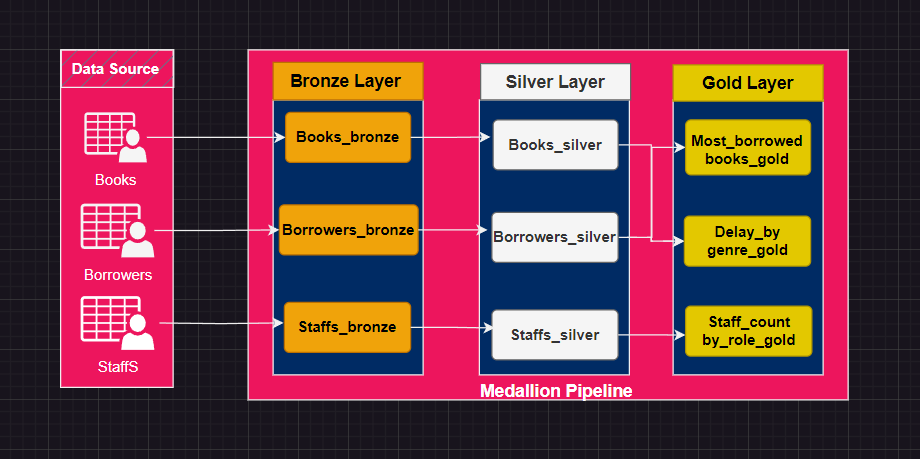
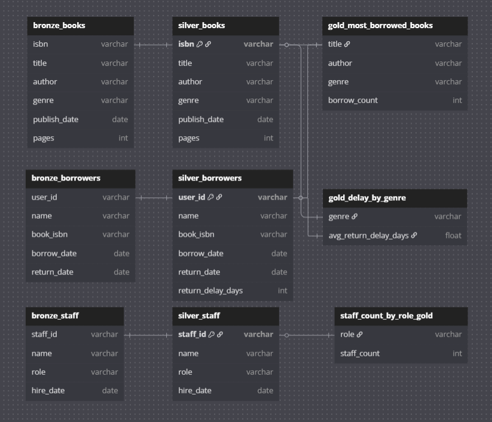
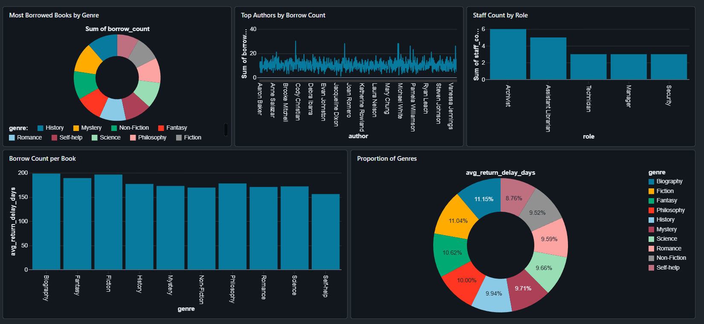

# FIRST STEPS WITH DATABRICKS: FROM ZERO TO LAKEHOUSE 

Welcome to the hands-on workshop for learning **Databricks Lakehouse Architecture** using the analogy of a **Library System**. This end-to-end demo showcases how to build scalable data pipelines using Bronze, Silver, and Gold layers to transform and prepare data for reliable analytics and reporting.

---

## Project Summary

This project simulates a public library managing:
- Books
- Borrowers
- Library staff

It walks participants through:
1. **Raw data ingestion (Bronze)**
2. **Data cleaning & enrichment (Silver)**
3. **Analytics (Gold)**
4. **Insights (Visualization Dashboard)**

---

## Dataset Overview

- `books.csv` — ~1,000 books with metadata
- `borrowers.csv` — ~10,000 borrowing records
- `staff.csv` — ~20 staff members

## How to Run the Project

> **Prerequisites**: Databricks Free Version or Enterprise Account Edition and an AWS Account

### 1. Clone the repository onto your Databricks using the below Link and the steps following: 

      `https://github.com/Rashidomar/workshop_demo_databricks.git`   

   1. Navigate to  `Workspace` on Databricks
       - From the left menu, go to the user workspace by:  
       - clicking on Workspace > Repos > `username@email_domain.com`: when you get here, create and select Git folder.
       - In the pop up window, enter this  `https://github.com/Rashidomar/workshop_demo_databricks.git` in the Git repository URL.
       - Click on Create Git Folder
       - Select SQL_notebooks
   3. You can now view and run the notebooks from your Databricks Workspace

### The Medallion Architecture of the library System
#### A medallion architecture is a data design pattern we are going to use to logically organize data with the goal of incrementally and progressively improving the structure and quality of data as it flows through each layer of the architecture from **Bronze ⇒ Silver ⇒ Gold layer tables**

### The Data Model of the library System
#### The data model defines the structure and relationships within your data. It serves as a blueprint for how data is stored, understood, and used across the organization. This is going general view of our datasets.

### The Visualization Dashboard
#### A dashboard translates data into actionable insights through visual storytelling. It allows decision-makers to monitor, explore, and act on key metrics in real time.

---

## Workshop Learning Goals

✅ Understand the Databricks Lakehouse concept  
✅ Apply Medallion Architecture best practices  
✅ Build an end-to-end ETL   
✅ Learn Delta Lake, Spark SQL, PySpark in context  

---

## Built With

- Databricks free edition
- PySpark / Spark SQL
- Delta Lake
---

## License

This project is open for educational use under the MIT License.
---

## Acknowledgments

Special thanks to:
- TheDataLead AI : www.thedatalead.ai
- All participants building the future with data
---

